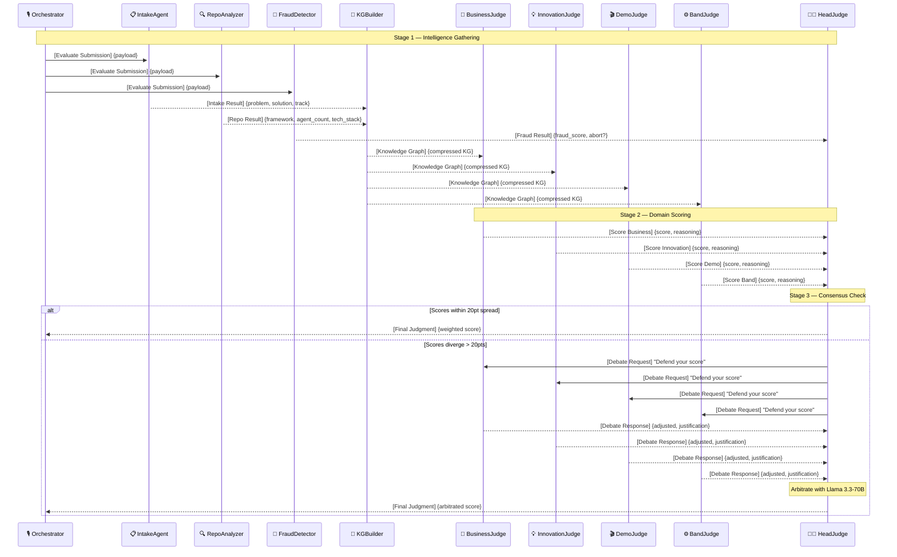
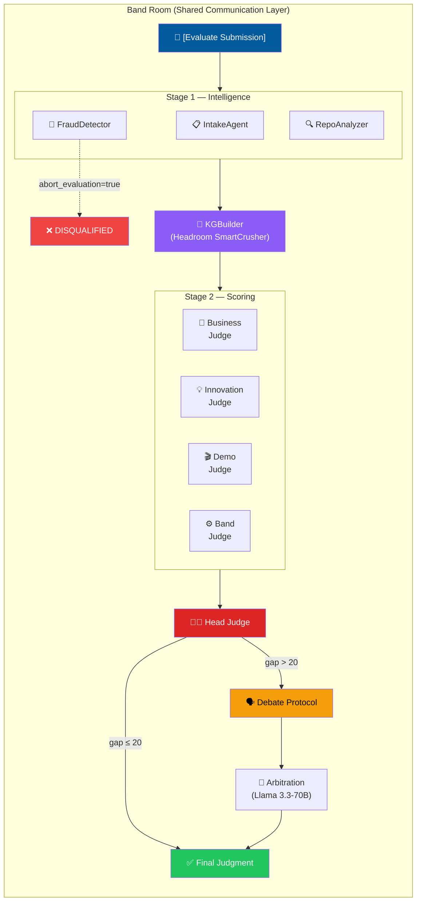

<p align="center">
  
  
  
  
  
</p>

# 🏛️ Hackathon Judge Panel

**A 9-agent autonomous jury system that evaluates hackathon submissions in real-time — powered by the Band multi-agent platform.**

Built for the [Band of Agents Hackathon](https://lablab.ai/ai-hackathons/band-of-agents-hackathon) on lablab.ai.

---

## 💡 The Problem

Hackathon organizers face a painful bottleneck: **judging hundreds of submissions fairly, quickly, and consistently**. Human judges are slow, biased, and expensive. Most AI solutions use a single monolithic prompt, which lacks depth, nuance, and accountability.

## 🎯 Our Solution

We built a **self-debating panel of 9 specialized AI agents** that coordinate inside a shared **Band Room** to evaluate submissions through a structured 3-stage pipeline:

1. **Stage 1 — Intelligence Gathering**: Four agents independently analyze the submission's metadata, code repository, and fraud indicators, then fuse their findings into a compressed knowledge graph.
2. **Stage 2 — Domain Scoring**: Four expert judges independently score the submission on Business Value, Innovation, Band Framework Usage, and Demo Quality.
3. **Stage 3 — Consensus & Arbitration**: A Head Judge checks for score divergence. If judges disagree by more than 20 points, it triggers a **debate protocol** where judges defend their scores. The Head Judge then arbitrates using a more powerful model.

**This is not a wrapper.** The agents don't run in a simple chain — they listen for specific message patterns in the Band Room, react asynchronously, and build consensus through structured dialogue.

---

## 🏗️ Architecture

### Agent Roster

| # | Agent | Stage | Role | Model |
|---|-------|-------|------|-------|
| 1 | **IntakeAgent** | 1 | Extracts structured metadata (problem, solution, track, features) from the submission description | Qwen 2.5-72B |
| 2 | **RepoAnalyzer** | 1 | Analyzes GitHub repo: tech stack, agent count, file tree, commit history, Band usage verification | Qwen 2.5-72B |
| 3 | **FraudDetector** | 1 | Checks for plagiarism, single-day code dumps, fake Band imports, missing setup files | Qwen 2.5-72B |
| 4 | **KGBuilderAgent** | 1 | Fuses all Stage 1 outputs into a compressed knowledge graph using Headroom SmartCrusher | — (no LLM) |
| 5 | **BusinessJudge** | 2 | Scores business value: market size, ROI, competitive advantage (0–100) | Qwen 2.5-72B |
| 6 | **InnovationJudge** | 2 | Scores technical novelty: architecture creativity, multi-agent design (0–100) | Qwen 2.5-72B |
| 7 | **BandJudge** | 2 | Scores Band framework integration depth: room usage, message routing, platform tools (0–100) | Qwen 2.5-72B |
| 8 | **DemoJudge** | 2 | Scores demo quality: clarity, completeness, working prototype evidence (0–100) | Qwen 2.5-72B |
| 9 | **HeadJudge** | 3 | Checks score divergence, triggers debate if needed, arbitrates final weighted score | Llama 3.3-70B |

### Message Flow



### Pipeline Architecture



---

## 🔑 Key Features

### 🤖 True Multi-Agent Coordination via Band
All 9 agents communicate through **message-prefix routing** inside a shared Band Room. Agents listen for specific prefixes (e.g., `[Evaluate Submission]`, `[Knowledge Graph]`, `[Debate Request]`) and respond only when their input conditions are met. This is event-driven — not a sequential chain.

### 🗣️ Self-Debating Consensus Protocol
When domain judge scores diverge by more than 20 points, the Head Judge triggers a **debate round**. Each judge must defend or adjust their score with written justification. The Head Judge then arbitrates using a stronger reasoning model to produce a fair final verdict.

### 🚨 Early Fraud Detection & Abort
The FraudDetector runs in parallel with other Stage 1 agents. If it identifies plagiarism, fake Band imports, or suspicious commit patterns, it flags an immediate abort — saving LLM costs by skipping the scoring stages entirely.

### 📊 Headroom Context Compression
All LLM calls are wrapped in [Headroom](https://github.com/chopratejas/headroom) `HeadroomChatModel`, which compresses context before every call. The KGBuilder further uses `SmartCrusher` to compress the knowledge graph. **Result: ~12,000 tokens per evaluation run** (down from ~71,000 without compression).

### ⚖️ Configurable Weighted Scoring
Final scores are computed with configurable category weights:
| Category | Weight |
|----------|--------|
| Business Value | 25% |
| Innovation | 20% |
| Band Framework Usage | 20% |
| Demo Quality | 15% |
| Code Quality | 20% |

### 🔄 Dual Execution Modes
- **Local Simulation** (`main.py`): MockBandRoom runs all 9 agents in-process with event-driven routing. No API keys or network needed for testing.
- **Production** (`run_production.py`): Connects each agent to the live Band Cloud platform (`app.band.ai`) via WebSocket for real-time multi-agent collaboration.

---

## 🚀 Quick Start

### Prerequisites
- Python 3.11+
- An [AI/ML API](https://aimlapi.com) key (powers all agents on one provider)
- *(Optional)* A [GitHub token](https://github.com/settings/tokens) for live repo analysis

### Installation

```bash
# Clone the repository
git clone https://github.com/YOUR_USERNAME/hackathon-judge-panel.git
cd hackathon-judge-panel

# Install dependencies
pip install -r requirements.txt

# Configure environment
cp .env.example .env
# Edit .env with your API keys
```

### Run Local Simulation

```bash
python main.py
```

This runs the full 9-agent pipeline against a sample submission using the local MockBandRoom simulator. No Band account needed.

### Run Tests

```bash
python test_pipeline.py
```

Executes 3 end-to-end test scenarios with mock LLMs:
- ✅ **Normal**: Direct scoring without debate (expected: 87.2/100)
- ✅ **Debate**: Score divergence triggers debate + arbitration (expected: 83.9/100)
- ✅ **Fraud**: Early abort and disqualification (expected: 0/100, DISQUALIFIED)

### Run on Live Band Platform

```bash
# 1. Register 9 agents at https://app.band.ai/agents
# 2. Add their Agent IDs and API Keys to .env
# 3. Launch all agents concurrently:
python run_production.py
```

---

## 📁 Project Structure

```
hackathon-judge-panel/
├── main.py                 # Orchestrator — triggers evaluation pipeline
├── run_production.py       # Production runner — connects to live Band Cloud
├── test_pipeline.py        # End-to-end test suite with mock LLMs
├── headroom_config.py      # Centralized config: models, weights, thresholds
├── requirements.txt        # Python dependencies
├── .env.example            # Environment variable template
│
├── core/
│   ├── llm.py              # Two-tier LLM routing (cheap + smart)
│   ├── band_simulator.py   # MockBandRoom — local event-driven simulator
│   ├── band_helper.py      # Message history search utilities
│   ├── band_room.py        # Score formatting helpers
│   └── knowledge_graph.py  # KG builder with Headroom SmartCrusher
│
├── stage1/                 # Intelligence gathering agents
│   ├── intake_agent.py     # Extracts submission metadata
│   ├── repo_analyzer.py    # Analyzes GitHub repositories
│   ├── fraud_detector.py   # Detects plagiarism and fraud
│   └── kg_builder_agent.py # Fuses outputs into knowledge graph
│
├── stage2/                 # Domain scoring judges
│   ├── business_judge.py   # Business value scoring
│   ├── innovation_judge.py # Technical novelty scoring
│   ├── band_judge.py       # Band framework usage scoring
│   └── demo_judge.py       # Demo quality scoring
│
└── judge/
    └── head_judge.py       # Final arbitration + debate protocol
```

---

## 🏆 Band Framework Integration

This project deeply integrates with the **Band SDK** (`band-sdk` v1.0.0):

| Band Feature | How We Use It |
|---|---|
| **`SimpleAdapter`** | All 9 agents subclass `SimpleAdapter[HistoryProvider]` for message handling |
| **`PlatformMessage`** | Every agent receives typed messages with sender info and metadata |
| **`HistoryProvider`** | Agents query room history to check for duplicates and find payloads |
| **`AgentToolsProtocol`** | Agents use `tools.send_message()` to broadcast results to the room |
| **`FakeAgentTools`** | Local MockBandRoom extends this for realistic offline simulation |
| **`Agent.create()`** | Production runner creates live agents with real API keys |
| **Chat Room Routing** | All coordination happens through message-prefix patterns in a shared room |

---

## 🧮 Cost Efficiency

| Metric | Without Headroom | With Headroom |
|--------|-----------------|---------------|
| Tokens per evaluation | ~71,000 | **~12,000** |
| Cost reduction | — | **83%** |
| LLM calls per evaluation | 9–13 | 9–13 |
| Expensive model calls | 0–1 (debate only) | 0–1 |

Only the **Head Judge** uses the expensive model, and only during debate arbitration. All other agents use the cost-efficient Qwen 2.5-72B via AI/ML API.

---

## 📜 License

MIT

---

<p align="center">
  Built with ❤️ for the <a href="https://lablab.ai/ai-hackathons/band-of-agents-hackathon">Band of Agents Hackathon</a>
  <br>
  Powered by <a href="https://band.ai">Band</a> · <a href="https://aimlapi.com">AI/ML API</a> · <a href="https://github.com/chopratejas/headroom">Headroom</a>
</p>
